[](https://openupm.com/packages/com.pixelrebels.fdb/)

# FuryDB

Static structured database for Unity. I create this project inspired by [CastleDB](http://castledb.org/).

- [Install](./Doc/Install/README.md)
- [How to use](#how-to-use)
- [Unity objects](#unity-objects)
- [Addressables](#addressables)
- [Supported types](#supported-types)
- [Unions](#unions)
- [Editor tools](#editor-tools)
- Attributes
    - [Space](#space-attribute)
    - [GroupBy](#groupby-attribute)
    - [Aggregate](#aggregate-attribute)
    - [MultilineText](#multilinetext-attribute)
    - [AutoRef](#autoref-attribute)
- [__GUID field](#__guid-field)
- [In the plans](#in-the-plans)
- [FuryDB Components](#furydb-components)

# How to use

First [Install FDB](./Doc/Install/README.md). Create your database class `DB.cs`:

```DB.cs
using FDB;

[FuryDB("Assets/Resources/DB.furydb", "Assets/Kinds.cs")]
public class DB
{
    
}
```

Create folder `Editor` and then create class `Editor/DBWindow.cs`

```Editor/DBWindow.cs
using UnityEditor;
using FDB.Editor;

public class DBWindow : DBInspector<DB>
{
    [MenuItem("Game/DB")]
    public static void Open()
    {
        var window = GetWindow<DBWindow>("DB");
        window.Show();
    }
}

```

Then open menu **Game -> DB** and look at window. Now you have empty database.

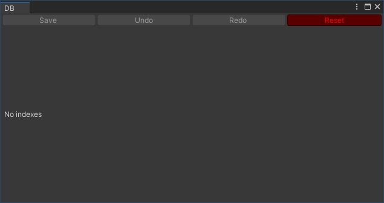

Now lets reach `DB.cs` with few types

```DB.cs
using FDB;

[FuryDB("Assets/Resources/DB.furydb", "Assets/Kinds.cs")]
public class DB
{
    public Index<UnitConfig> Units;
    public Index<WeaponConfig> Weapons;
    public Index<TextConfig> Texts;
}

public class UnitConfig
{
    public Kind<UnitConfig> Kind;
    public Ref<TextConfig> Name;
    public int Str;
    public int Dex;
    public int Int;
    public int Chr;
    public Ref<WeaponConfig> Weapon;
}

public enum WeaponType
{
    Melee,
    Range
}

public class WeaponConfig
{
    public Kind<WeaponConfig> Kind;
    public Ref<TextConfig> Name;
    public WeaponType Type;
    public int Damage;
    public int DamageVar;
}

public class TextConfig
{
    public Kind<TextConfig> Kind;
    public string En;
    public string Ru;
}
```

We have main `DB` class with three pubic fields

```
    public Index<UnitConfig> Units;
    public Index<WeaponConfig> Weapons;
    public Index<TextConfig> Texts;
```

This is three tables you can to edit. Every table have types: `UnitConfig` `WeaponConfig` or `TextConfig`

> [!IMPORTANT]  
> Every class in Index must contains field `Kind`

Look to class UserConfig it have following fields

- `Kind<UnitConfig> Kind` - this is unique name of config. If it possible this kind exports to file `Kinds.cs`. If kind not possible to export it mark little darkness and eye icon
- `Ref<TextConfig> Name` - this mean that unit refered to config from `Index<TextConfig>` you first need goto to page `Texts` add line and after select this line in `Unit.Name` field
- `Str` `Dex` `Int` `Chr` are `int`. This just number
- `Ref<WeaponConfig> Weapon` - this is reference again but to table `Weapons`
}

Fill database with data.

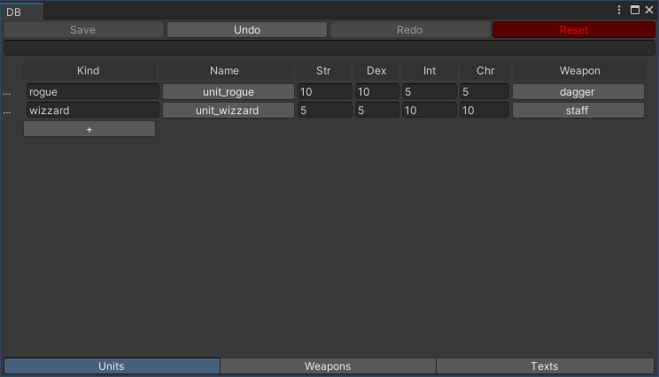
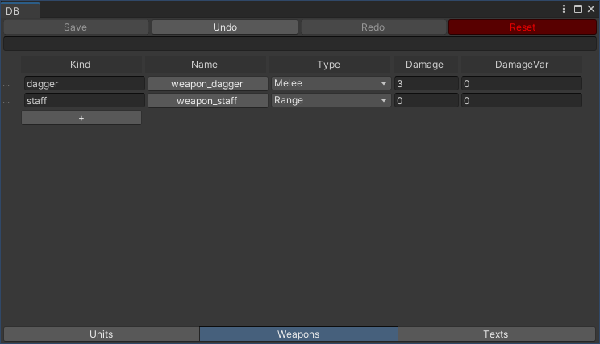
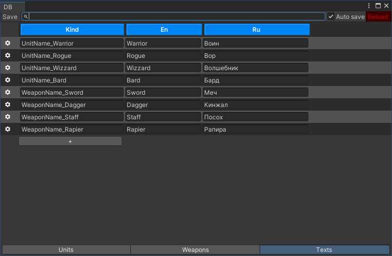

Now you can load database in your code

```Boot.cs
class Boot {
    public static DB DB { get; private set; }
    void Awake() {
        DB = DBResolver.Load<DB>();
        foreach (var unit in DB.Units.All()) {
            Debug.Log(unit.Kind);
        }
    }
}
```

You also can access for db items using `Kinds.cs`:

```Boot.cs
class Boot {
    public static DB DB { get; private set; }
    void Awake() {
        DB = DBResolver.Load<DB>();
        var rogue = DB.Units.Get(Kinds.Units.Rogue);
    }
}
```

# Unity objects

You can save to config reference to unity objects: Prefabs/ScriptableObjects/Sprites/Textures/...

All unity objects will add dependency of db.furydb-file. You can use it like regular unity objects

# Addressables

If you need attach prefab MonoBehaviour(Prefab) or ScriptableObject to your config you need [Addressables](https://docs.unity3d.com/Manual/com.unity.addressables.html) and types `AssetReference` or `AssetReferenceT<>`

Well you have prefab

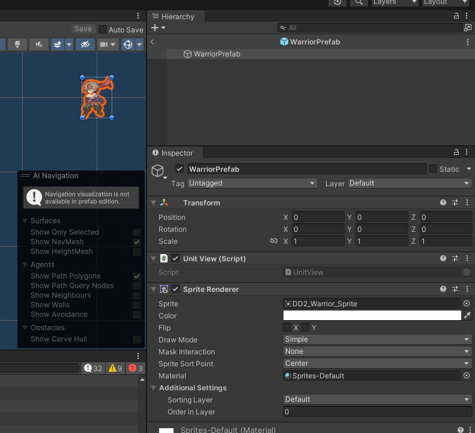

Browse prefab in hierarchy window and turn on toggle `Addressable`

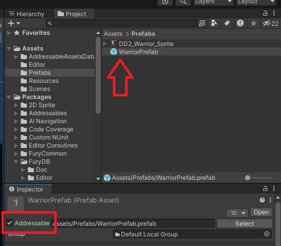

Add field `Prefab` in UnitConfig
```
public class UnitConfig
{
    public Kind<UnitConfig> Kind;
    public Ref<TextConfig> Name;
    public AssetReference Prefab; // <<<<

    [Space]
    public int Str;
    public int Dex;
    public int Int;
    public int Chr;

    [Space]
    public Ref<WeaponConfig> Weapon;
}
```

And drag prefab into unit field

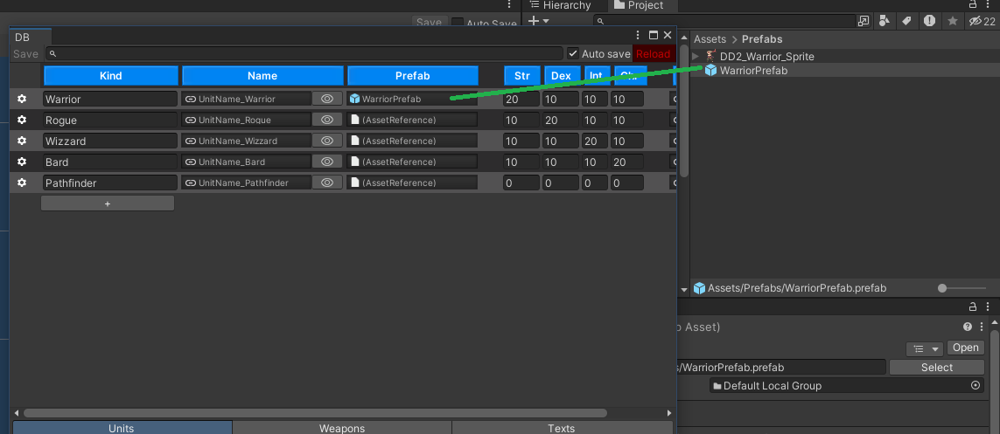

Add code for load prefab int Boot
```
class Boot : MonoBehaviour
{
    public static DB DB { get; private set; }

    private async void Awake()
    {
        DB = DBResolver.Load<DB>();
        var warrior = DB.Units[Kinds.Units.Warrior];
        var prefab = await warrior.Prefab.InstantiateAsync().Task;
    }
}
```

Run game and look to result.

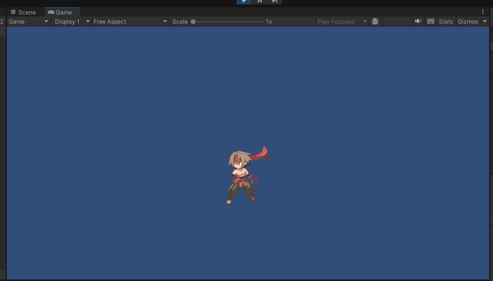

Read more about addressable and resource management in Internet.

# Editor tools

For read and edit database from editor use `EditorDB<DB>.DB`

> [!WARNING]  
> EditorDB available only in `UNITY_EDITOR`

When you modify some data from `EditorDB<DB>` call `EditorDB<DB>.SetDirty()`

## Supported types

- bool
- int
- float
- string
- enum
- Color
- AnimationCurve
- List<>
- Ref<>
- Union<>
- AssetReference
- AssetReferenceT<>
- Other unity types:
    - Prefabs
    - Scriptable objects
    - Sprites
    - Textures
    - ...

### Unions

Union this is an object that can change its type

```
public class DB1
{
    public Index<PerkConfig> Perks;
}

public class PerkConfig
{
    public Kind<PerkConfig> Kind;
    public List<VariableRecord> Variables;

    public class VariableRecord
    {
        public string Name;
        public VariableUnion Value;
    }

    public class VariableUnion : Union
    {
        public int Int;
        public bool Bool;
        public List<Color> Colors;
    }
}
```

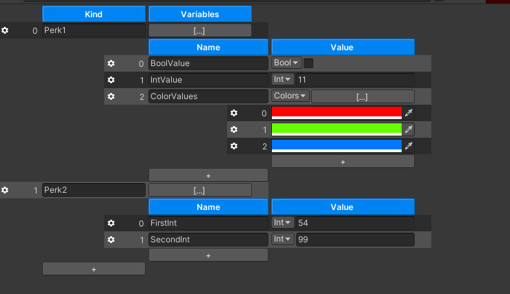

You can use Union.UnionTag field for read union type

```
var DB = DBResolver.Load<DB>();
foreach (var variable in DB.Perks[Kinds.Perks.Perk1].Variables)
{
    switch (variable.Value.UnionTag)
    {
        case "Int":
            Debug.Log($"{variable.Name} = {variable.Value.Int}");
            break;
        case "Bool":
            Debug.Log($"{variable.Name} = {variable.Value.Bool}");
            break;
        case "Colors":
            Debug.Log($"{variable.Name} = {variable.Value.Colors.Count}");
            break;
    }
}

> BoolValue = False
> IntValue = 11
> ColorValues = 3
```

For more safety use enum

```
public enum VariableUnionTag {
    Int,
    Bool,
    Colors
}

public class VariableUnion : Union<VariableUnionTag>
{
    public int Int;
    public bool Bool;
    public List<Color> Colors;
}

...
switch (variable.Value.UnionTag)
{
    case VariableUnionTag.Int:
        ...
    case VariableUnionTag.Bool:
        ...
    case VariableUnionTag.Colors:
        ...
}
```

## Space Attribute

`UnityEngine.SpaceAttribyte` add vertical space between columns

```Unit.cs
public class UnitConfig
{
    public Kind<UnitConfig> Kind;
    public Ref<TextConfig> Name;

    [Space]
    public int Str;
    public int Dex;
    public int Int;
    public int Chr;

    [Space]
    public Ref<WeaponConfig> Weapon;
}
```

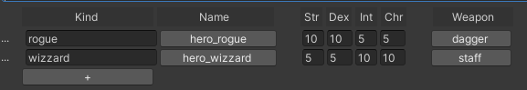

## GroupBy Attribute

Separete lines using regexp

```DB.cs
public class DB
{
    //...
    [GroupBy("Kind", @"(.+?)_")]
    public Index<TextConfig> Texts;
}
```

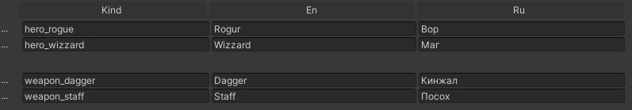

## Aggregate Attribute

```DB.cs
public class UnitConfig
{
    ///...
    [Aggregate("Sum")]
    public List<int> Levelups;

    private static int Sum(int a, int b)
    {
        return a + b;
    }
}
```

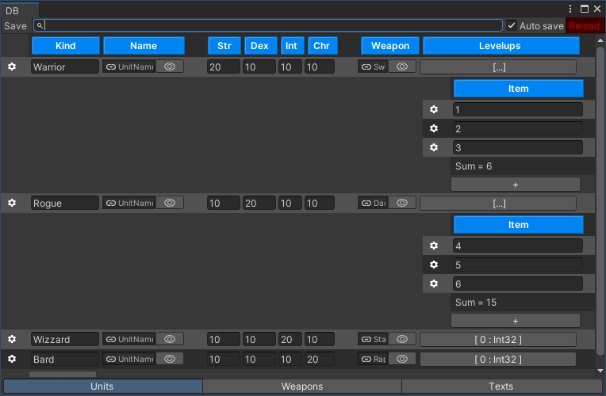

```DB.cs
public class DB
{
    [GroupBy("Kind", @"(.+?)_")]
    [Aggregate(nameof(CalcTextChars), typeof(TextAgg))]
    public Index<TextConfig> Texts;

    private static TextAgg CalcTextChars(TextAgg agg, TextConfig config)
    {
        agg.EnChars += config.En.Length;
        agg.RuChars += config.Ru.Length;
        return agg;
    }

    private class TextAgg
    {
        public int EnChars;
        public int RuChars;
        public override string ToString()
        {
            return $"EN chars = {EnChars}\nRU chars = {RuChars}";
        }
    }
}
```

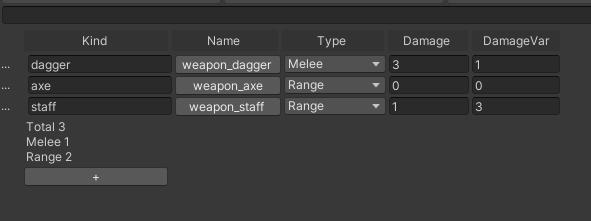

## MultilineText Attribute

```TextConfig.cs
public class TextConfig
{
    public Kind<TextConfig> Kind;
    [MultilineText(MinLines = 3, Condition = "IsMultiline")]
    public string En;
    [MultilineText(MinLines = 3, Condition = "IsMultiline")]
    public string Ru;

    static bool IsMultiline(TextConfig config)
    {
        var kind = config.Kind.Value;
        if (kind == null)
            return false;
        return kind.Contains("Description_");
    }
}
```

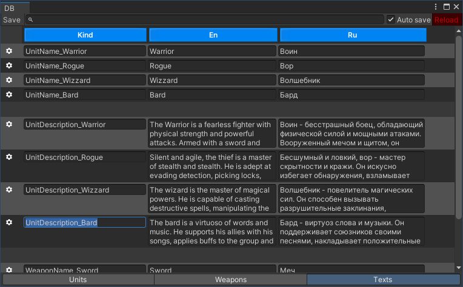

## AutoRef Attribute

You have a way to quickly create links to other tables an attribute `AutoRef`:

```
public class UnitConfig
{
    public Kind<UnitConfig> Kind;
    [AutoRef(Prefix ="UnitName_")]
    public Ref<TextConfig> Name;

    //
}
```

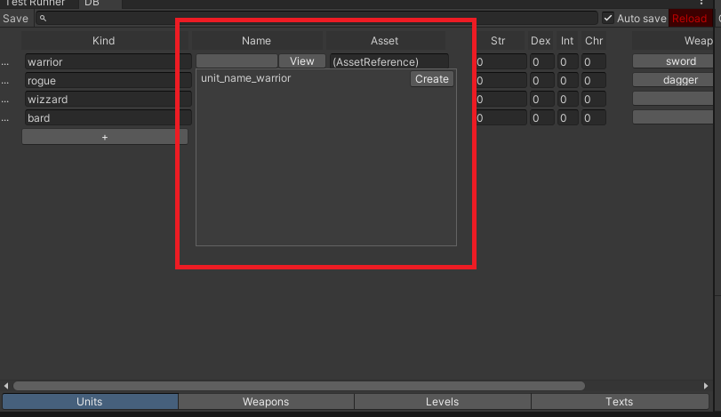

Press "Create" and start edit TextConfg-record

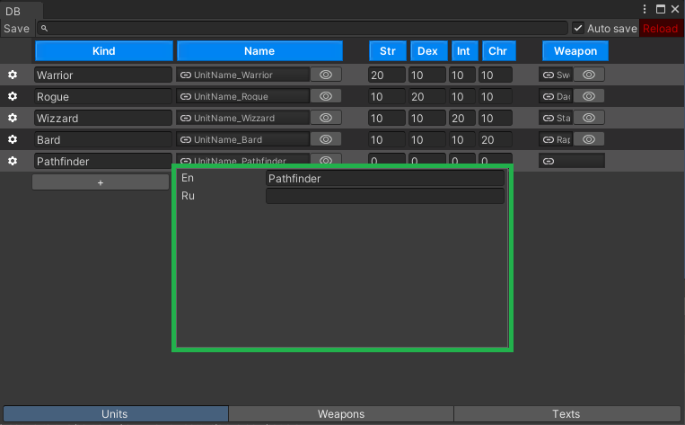

New line insert in the end of group of same lines

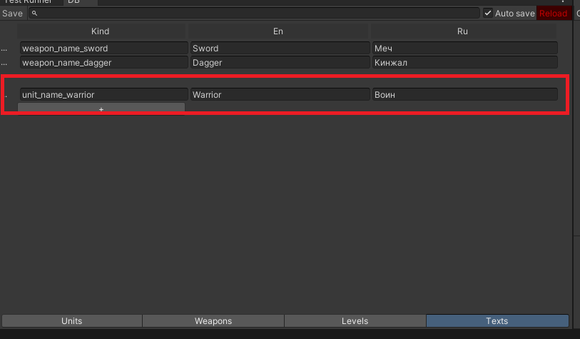

## __GUID field

You can declare filed `__GUID` in any object.

```DB.cs
class UserConfig {
    public string __GUID; // Not visible in DBWindow but work!
    public Kind<UserConfig> Kind;
}
```

Field automatic fill GUID values

# In the plans

Add support for field types:
- `TimeSpan`
- `DateTime`

Add attributes:
- `ShowCondition` for hide field by condition
- `Display` field for build preview when you look reference list
- `Validate` attribute for add user rules to validate configs
- `RequireAssetComponent` check that gameObject containst required component when you drag prefab to `AssetReference`

DBWindow
- Toggles for hide columns
- Toggle to disable rows groupping
- Undo/Redo
- Drag-n-drop for rows
- Improve work with multiline text fields

# FuryDB Components

Use [FuryDB Components](https://github.com/ze0nni/FuryDB.Components) package for integrate database with unity