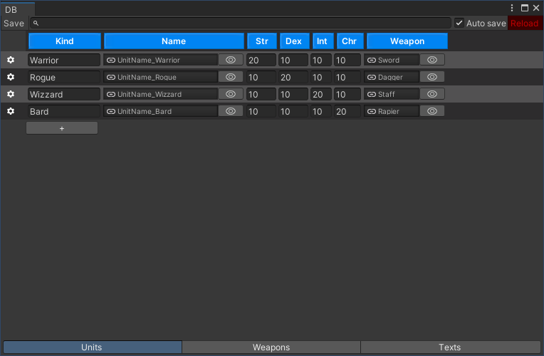
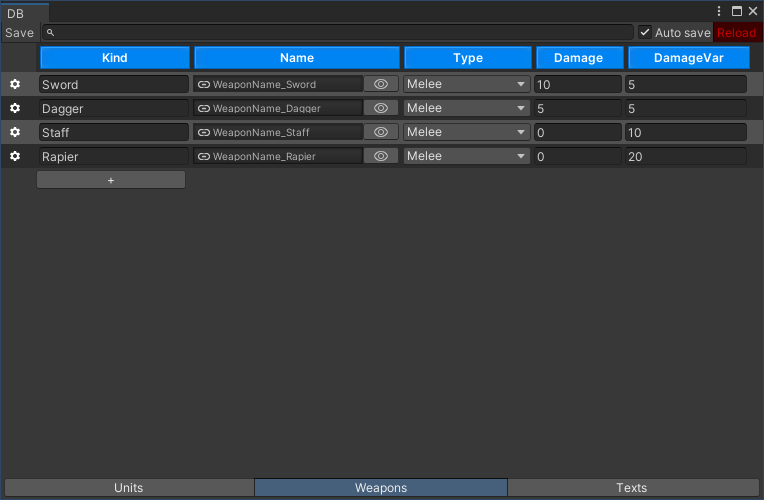
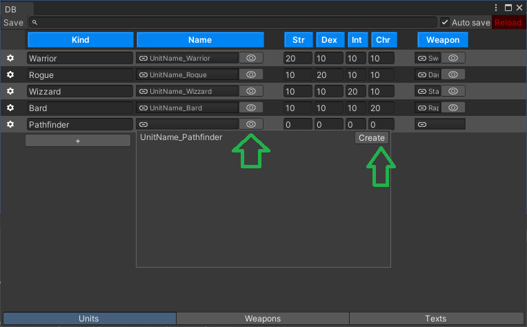
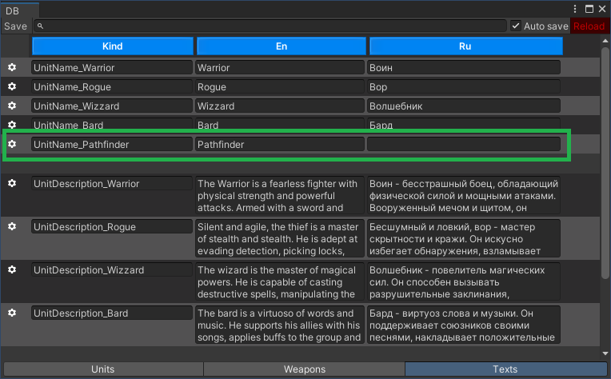

[](https://openupm.com/packages/com.pixelrebels.fdb/)

# FuryDB

Static structured database for Unity. I create this project inspired by [CastleDB](http://castledb.org/).

- [Install](./Doc/Install/README.md)
- [How to use](#how-to-use)
- [Supported types](#supported-types)
- Attributes
    - [Space](#space-attribute)
    - [GroupBy](#groupby-attribute)
    - [Aggregate](#aggregate-attribute)
    - [MultilineText](#multilinetext-attribute)
    - [AutoRef](#autoref-attribute)
- [__GUID field](#__guid-field)
- [FuryDB Components](#furydb-components)

# How to use

First [Install FDB](./Doc/Install/README.md). Create your database class `DB.cs`:

```DB.cs
using FDB;
using Newtonsoft.Json;

[JsonConverter(typeof(DBConverter<DB>))]
[FuryDB("Assets/Resources/DB.json.txt", "Assets/Kinds.cs")]
public class DB
{
    
}
```

Create folder `Editor` and then create class `Editor/DBWindow.cs`

```Editor/DBWindow.cs
using UnityEditor;
using FDB.Editor;

public class DBWindow : DBInspector<DB>
{
    [MenuItem("Game/DB")]
    public static void Open()
    {
        var window = GetWindow<DBWindow>("DB");
        window.Show();
    }
}

```

Then open **Game -> DB** and look at window. Now you have empty database.


Now lets reach `DB.cs` with few types

```DB.cs
using FDB;
using Newtonsoft.Json;

[JsonConverter(typeof(DBConverter<DB>))]
[FuryDB("Assets/Resources/DB.json.txt", "Assets/Kinds.cs")]
public class DB
{
    public Index<UnitConfig> Units;
    public Index<WeaponConfig> Weapons;
    public Index<TextConfig> Texts;
}

public class UnitConfig
{
    public Kind<UnitConfig> Kind;
    public Ref<TextConfig> Name;
    public int Str;
    public int Dex;
    public int Int;
    public int Chr;
    public Ref<WeaponConfig> Weapon;
}

public enum WeaponType
{
    Melee,
    Range
}

public class WeaponConfig
{
    public Kind<WeaponConfig> Kind;
    public Ref<TextConfig> Name;
    public WeaponType Type;
    public int Damage;
    public int DamageVar;
}

public class TextConfig
{
    public Kind<TextConfig> Kind;
    public string En;
    public string Ru;
}
```

> [!IMPORTANT]  
> Every class in Index must contains field `Kind`

And fill database with data.





Now you can load database in your code

```Boot.cs
class Boot {
    public static DB DB { get; private set; }
    void Awake() {
        DB = DBResolver.Load<DB>();
        foreach (var unit in DB.Units.All()) {
            Debug.Log(unit.Kind);
        }
    }
}
```

You also can access for db items using `Kinds.cs`:

```Boot.cs
class Boot {
    public static DB DB { get; private set; }
    void Awake() {
        DB = DBResolver.Load<DB>();
        var rogue = DB.Units.Get(Kinds.Units.Rogue);
    }
}
```

For read and edit database from editor use `EditorDB<DB>.DB`

> [!WARNING]  
> EditorDB available only in `UNITY_EDITOR`

## Supported types

- bool
- int
- float
- string
- enum
- Color
- AnimationCurve
- List<>
- Ref<>
- AssetReference
- AssetReferenceT<>

In planes:
- TimeSpan
- DateTime

## Space Attribute

`UnityEngine.SpaceAttribyte` add vertical space between columns

```Unit.cs
public class UnitConfig
{
    public Kind<UnitConfig> Kind;
    public Ref<TextConfig> Name;

    [Space]
    public int Str;
    public int Dex;
    public int Int;
    public int Chr;

    [Space]
    public Ref<WeaponConfig> Weapon;
}
```


## GroupBy Attribute

Separete lines using regexp

```DB.cs
public class DB
{
    //...
    [GroupBy("Kind", @"(.+?)_")]
    public Index<TextConfig> Texts;
}
```


## Aggregate Attribute

```DB.cs
public class UnitConfig
{
    ///...
    [Aggregate("Sum")]
    public List<int> Levelups;

    private static int Sum(int a, int b)
    {
        return a + b;
    }
}
```


```DB.cs
public class DB
{
    [GroupBy("Kind", @"(.+?)_")]
    [Aggregate(nameof(CalcTextChars), typeof(TextAgg))]
    public Index<TextConfig> Texts;

    private static TextAgg CalcTextChars(TextAgg agg, TextConfig config)
    {
        agg.EnChars += config.En.Length;
        agg.RuChars += config.Ru.Length;
        return agg;
    }

    private class TextAgg
    {
        public int EnChars;
        public int RuChars;
        public override string ToString()
        {
            return $"EN chars = {EnChars}\nRU chars = {RuChars}";
        }
    }
}
```


## MultilineText Attribute

```TextConfig.cs
public class TextConfig
{
    public Kind<TextConfig> Kind;
    [MultilineText(MinLines = 3, Condition = "IsMultiline")]
    public string En;
    [MultilineText(MinLines = 3, Condition = "IsMultiline")]
    public string Ru;

    static bool IsMultiline(TextConfig config)
    {
        var kind = config.Kind.Value;
        if (kind == null)
            return false;
        return kind.Contains("Description_");
    }
}
```


## AutoRef Attribute

You have a way to quickly create links to other tables an attribute `AutoRef`:

```
public class UnitConfig
{
    public Kind<UnitConfig> Kind;
    [AutoRef(Prefix ="UnitName_")]
    public Ref<TextConfig> Name;

    //
}
```



Press "Create" and start edit TextConfg-record


New line insert in the end of group of same lines



## __GUID field

You can declare filed `__GUID` in any object.

```DB.cs
class UserConfig {
    public string __GUID; // Not visible in DBWindow but work!
    public Kind<UserConfig> Kind;
}
```

Field automatic fill GUID values

# FuryDB Components

Use [FuryDB Components](https://github.com/ze0nni/FuryDB.Components) package for integrate database with unity