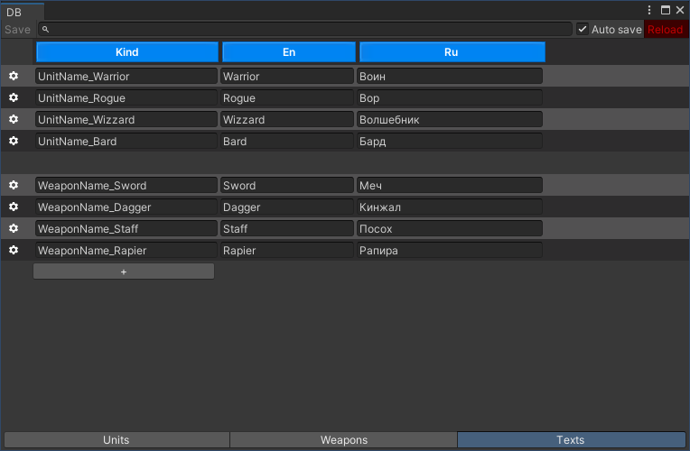
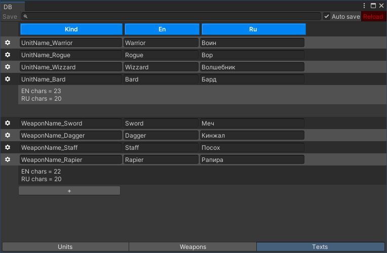

[](https://openupm.com/packages/com.pixelrebels.fdb/)

# FuryDB

Static structured database for Unity. I create this project inspired by [CastleDB](http://castledb.org/).

# How to use

First [Install FDB](./Doc/Install/README.md). Create your database class `DB.cs`:

```DB.cs
using FDB;
using Newtonsoft.Json;

[JsonConverter(typeof(DBConverter<DB>))]
[FuryDB("Assets/Resources/DB.json.txt", "Assets/Kinds.cs")]
public class DB
{
    
}
```

Create folder `Editor` and then create class `Editor/DBWindow.cs`

```Editor/DBWindow.cs
using UnityEditor;
using FDB.Editor;

public class DBWindow : DBInspector<DB>
{
    [MenuItem("Game/DB")]
    public static void Open()
    {
        var window = GetWindow<DBWindow>("DB");
        window.Show();
    }
}

```

Then open **Game -> DB** and look at window. Now you have empty database.


Now lets reach `DB.cs` with few types

```DB.cs
using FDB;
using Newtonsoft.Json;

[JsonConverter(typeof(DBConverter<DB>))]
[FuryDB("Assets/Resources/DB.json.txt", "Assets/Kinds.cs")]
public class DB
{
    public Index<UnitConfig> Units;
    public Index<WeaponConfig> Weapons;
    public Index<TextConfig> Texts;
}

public class UnitConfig
{
    public Kind<UnitConfig> Kind;
    public Ref<TextConfig> Name;
    public int Str;
    public int Dex;
    public int Int;
    public int Chr;
    public Ref<WeaponConfig> Weapon;
}

public enum WeaponType
{
    Melee,
    Range
}

public class WeaponConfig
{
    public Kind<WeaponConfig> Kind;
    public Ref<TextConfig> Name;
    public WeaponType Type;
    public int Damage;
    public int DamageVar;
}

public class TextConfig
{
    public Kind<TextConfig> Kind;
    public string En;
    public string Ru;
}
```

And fill database with data. Don't forget press **Save**


Now you can load database in your code

```Boot.cs
var db = DBResolver.Load<DB>();
foreach (var unit in db.Units.All()) {
    Debug.Log(unit.Kind);
}
```

You also can access for db items using `Kinds.cs`:

```Boot.cs
var db = DBResolver.Load<DB>();
var rogue = db.Units.Get(Kinds.Units.rogue);
```

## Supported types

- bool
- int
- float
- string
- enum
- Color
- AnimationCurve
- List<>
- Ref<>
- AssetReference

## Space Attribute

`UnityEngine.SpaceAttribyte` add vertical space between columns

```Unit.cs
public class UnitConfig
{
    public Kind<UnitConfig> Kind;
    public Ref<TextConfig> Name;

    [Space]
    public int Str;
    public int Dex;
    public int Int;
    public int Chr;

    [Space]
    public Ref<WeaponConfig> Weapon;
}
```


## GroupBy Attribute

Separete lines using regexp

```DB.cs
public class DB
{
    //...
    [GroupBy("Kind", @"(.+?)_")]
    public Index<TextConfig> Texts;
}
```



## Aggregate Attribute

```DB.cs
public class UnitConfig
{
    ///...
    [Aggregate("Sum")]
    public List<int> Levelups;

    private static int Sum(int a, int b)
    {
        return a + b;
    }
}
```


```DB.cs
public class DB
{
    //...
    [Aggregate("GeWeapontStatistics", typeof(WeaponAgg))]
    public Index<WeaponConfig> Weapons;

    private static WeaponAgg GeWeapontStatistics(WeaponAgg agg, WeaponConfig config)
    {
        agg.Total++;
        switch (config.Type)
        {
            case WeaponType.Melee:
                agg.Melee++;
                break;
            case WeaponType.Range:
                agg.Range++;
                break;
        }

        return agg;
    }
    private class WeaponAgg
    {
        public int Total;
        public int Melee;
        public int Range;

        public override string ToString()
        {
            return $"Total {Total}\nMelee {Melee}\nRange {Range}";
        }
    }
}
```



## MultilineText Attribute

```TextConfig.cs
public class TextConfig
{
    public Kind<TextConfig> Kind;

    [MultilineText(MinLines = 3, Condition = "IsMultiline")]
    public string En;
    [MultilineText(MinLines = 3, Condition = "IsMultiline")]
    public string Ru;

    private static bool IsMultiline(TextConfig config)
    {
        return config.Kind.Value != null &&
            config.Kind.Value.EndsWith("_text");
    }
}
```

